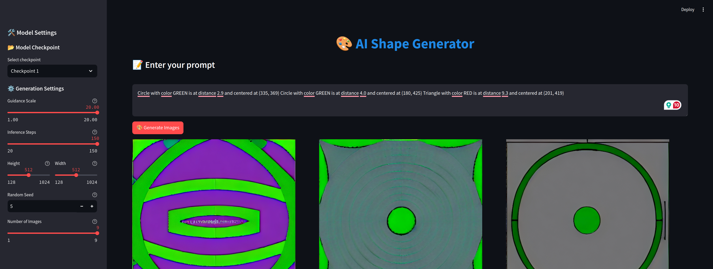

# Diffusion Module

This directory contains the core implementation for training and evaluating diffusion models. It includes tools for dataset handling, training, and evaluation.

---

## Structure

```
diffusion/
│
├── datasets/               # Dataset loaders
│   ├── base_dataset.py     # Abstract base class for datasets
│   ├── simulated_dataset.py# Simulated dataset with geometric shapes
│   ├── nuscenes_dataset.py # Placeholder for nuScenes dataset
│   └── __init__.py
│
├── modules/                # Model definitions
│   └── __init__.py
│
├── training/               # Training loop
│   └── __init__.py
│
├── evaluation/             # Evaluation tools
│   ├── eval_tool.py        # Streamlit-based evaluation tool
│   └── __init__.py
│
└── __init__.py             # Marks the `diffusion` directory as a package
```

---

## Requirements

Ensure the following are installed in your environment:
- Python 3.10
- PyTorch
- Diffusers
- PEFT (Parameter-Efficient Fine-Tuning)
- Streamlit
- Accelerate

You can install these dependencies using the `requirements.txt` in the project root.

---

## Usage

### Adding the Root Directory to PYTHONPATH

To run any script in this directory, ensure the root of the repository is added to `PYTHONPATH`. This allows Python to resolve the imports correctly.

1. Temporarily add the root directory:
    ```bash
    export PYTHONPATH=$(pwd)
    ```

2. Make it persistent by adding this to your shell configuration file (e.g., `~/.bashrc` or `~/.zshrc`):
    ```bash
    echo 'export PYTHONPATH=$(pwd)' >> ~/.bashrc
    source ~/.bashrc
    ```

---

## Training (trainer.py)

The training script uses LoRA (Low-Rank Adaptation) to efficiently fine-tune Stable Diffusion models.

### Training Arguments

```bash
python -m src.diffusion.training.trainer \
    --pretrained_model_name_or_path="runwayml/stable-diffusion-v1-5" \
    --dataset_name="arminpcm/my_shapes_dataset" \
    --output_dir="sd-shapes-model" \
    --resolution=512 \
    --train_batch_size=1 \
    --num_train_epochs=100 \
    --learning_rate=1e-4 \
    --mixed_precision="fp16" \
    --rank=4
```

#### Key Arguments:
- `--pretrained_model_name_or_path`: Base model to fine-tune (default: "runwayml/stable-diffusion-v1-5")
- `--dataset_name`: HuggingFace dataset to use for training
- `--output_dir`: Directory to save model checkpoints
- `--resolution`: Image resolution for training (default: 512)
- `--train_batch_size`: Batch size per GPU (default: 4)
- `--num_train_epochs`: Number of training epochs (default: 100)
- `--learning_rate`: Learning rate (default: 1e-5)
- `--mixed_precision`: Mixed precision training ["no", "fp16", "bf16"] (default: "fp16")
- `--rank`: LoRA rank for parameter-efficient fine-tuning (default: 4)
- `--gradient_accumulation_steps`: Number of steps for gradient accumulation (default: 1)
- `--lr_scheduler`: Learning rate scheduler type (default: "constant")
- `--lr_warmup_steps`: Number of warmup steps (default: 500)

---

## Evaluation (eval_tool.py)

The evaluation tool provides a user-friendly interface for generating images using the trained model.

### Running the Tool

```bash
streamlit run src/diffusion/evaluation/eval_tool.py
```

### Features and Parameters

#### Model Settings:
- **Checkpoint Selection**: Choose from available training checkpoints
- **Guidance Scale**: Control how closely the generation follows the prompt (1.0-20.0)
- **Inference Steps**: Balance quality vs. speed (20-150 steps)
- **Image Dimensions**: Select output resolution (128-1024 pixels)
- **Random Seed**: Set for reproducible results (-1 for random)
- **Number of Images**: Generate multiple variations (1-9 images)

#### Usage Tips:
1. Select a checkpoint from the sidebar
2. Adjust generation parameters as needed
3. Enter your prompt in the text area
4. Click "Generate Images" to create variations
5. Images are displayed in a grid layout


*The Streamlit-based interface for generating images with the fine-tuned model*

#### Example Prompts:
```
Triangle with color PURPLE is at distance 7.5 and centered at (303, 153)
```

---

## Contributing

Feel free to add new datasets, improve models, or extend the evaluation tool. Submit pull requests to propose changes.

---

## License

This project is licensed under the MIT License. See the LICENSE file in the project root for details.